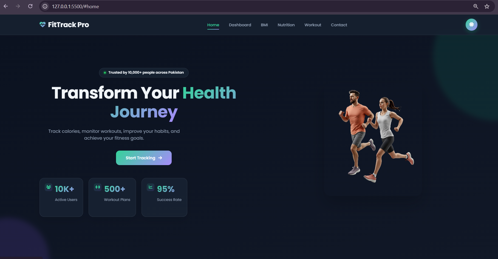
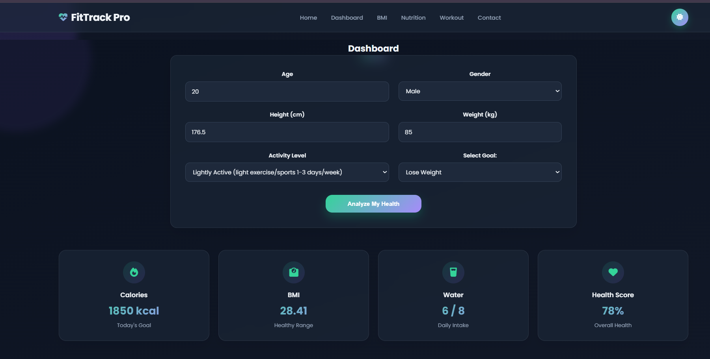
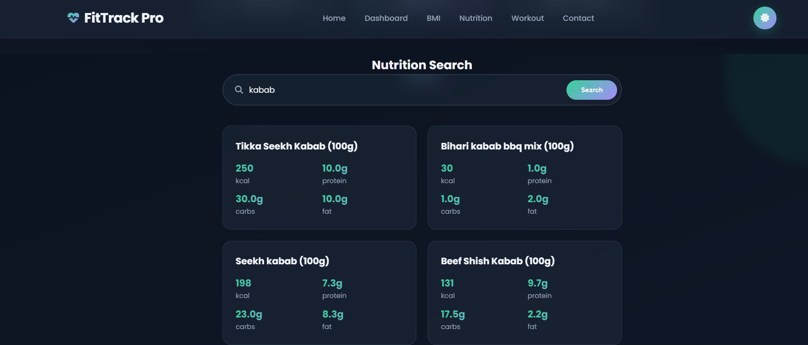
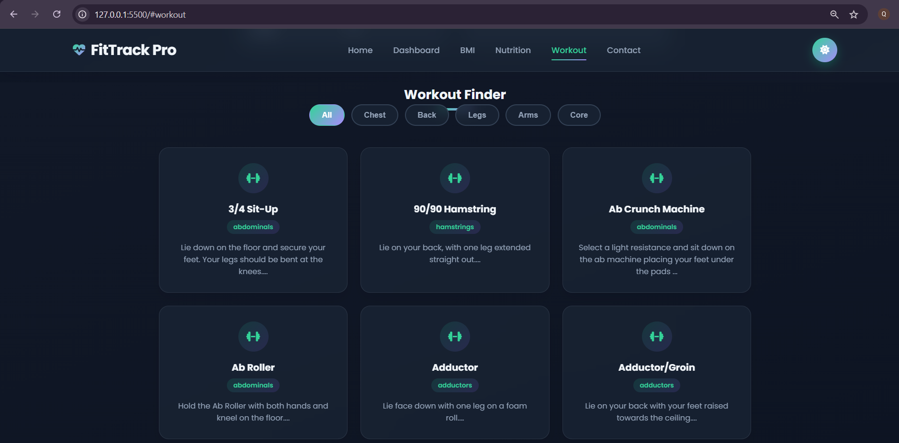
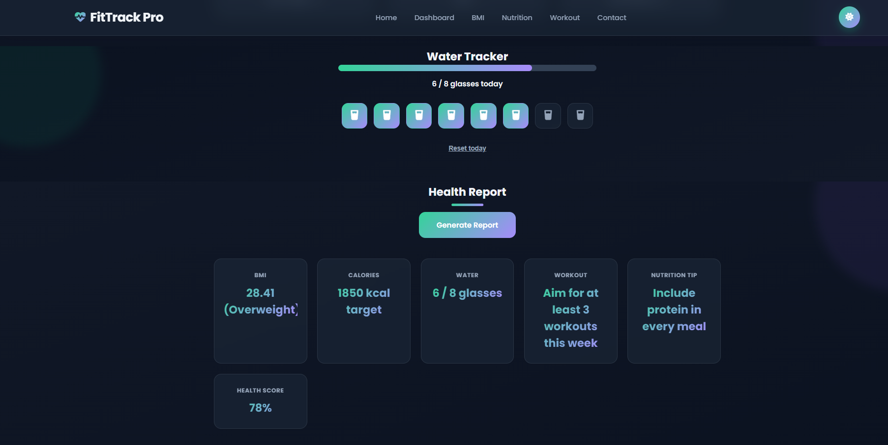

# 🏋️ FitTrack Pro

A modern Health & Fitness Tracking web application built using HTML, CSS, and JavaScript.

## 🚀 Live Demo

https://fittrack-pro-khan.netlify.app/

## ✨ Features

- BMI Calculator
- Calorie Calculator
- Nutrition Search
- Workout Finder
- Water Tracker
- Health Report
- Dark Mode
- Responsive Design
- Local Storage

## 🛠️ Technologies Used

- HTML5
- CSS3
- JavaScript
- Open Food Facts API
- Exercise API

## 📂 Project Link

GitHub:
https://github.com/takhancode/FitTrack

## 👨‍💻 Developer

Khan

## 📸 Screenshots

### 🏠 Hero Section

### 📊 Dashboard

### 🥗 Nutrition Search

### 💪 Workout Finder

### 💧 Water Tracker

